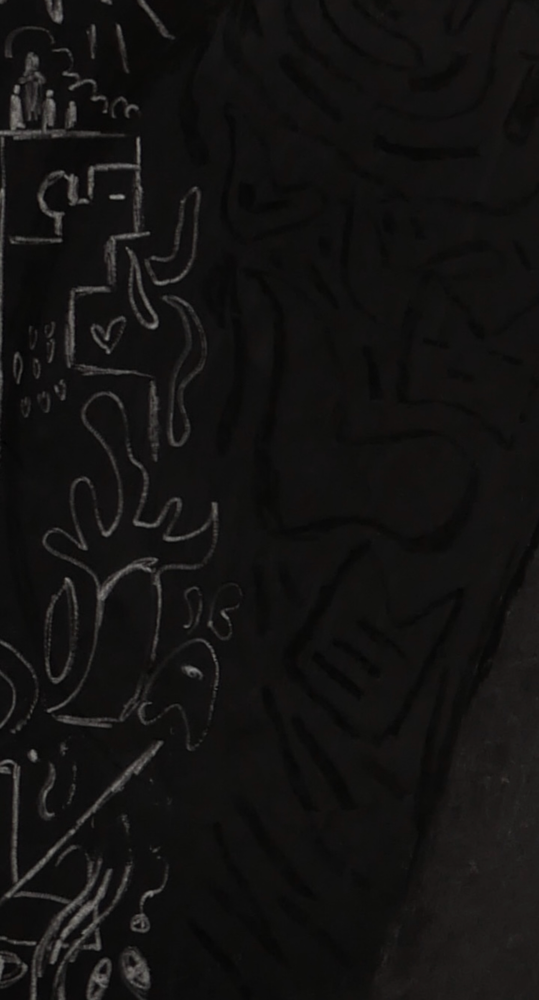
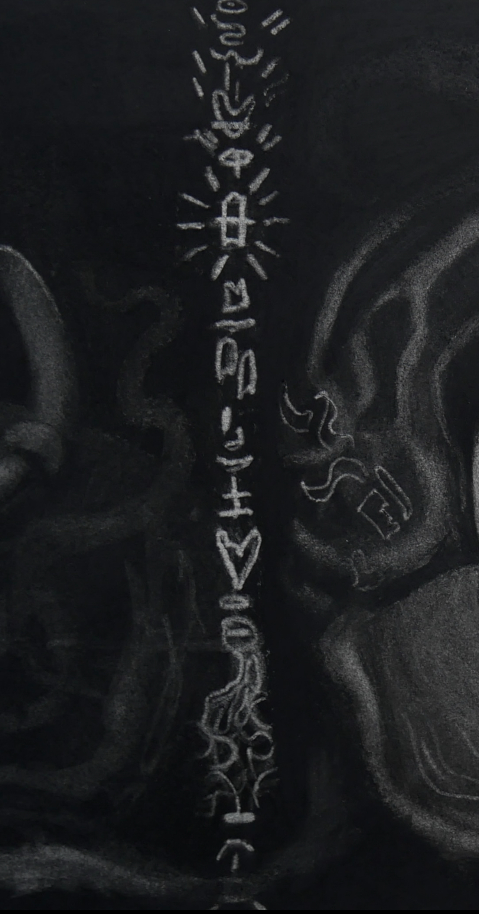

# CC-M3-Project

Mintedian Symbol Generator: Alfonso Garcia

A program meant to help guide my creative process for my charcoal drawings. In my work, I often have expanses of shadow where I draw patterns of symbols.

This process is largely intuitive, often done with no set order or path in mind. For this project, I wanted to not only simulate a patch of thes
